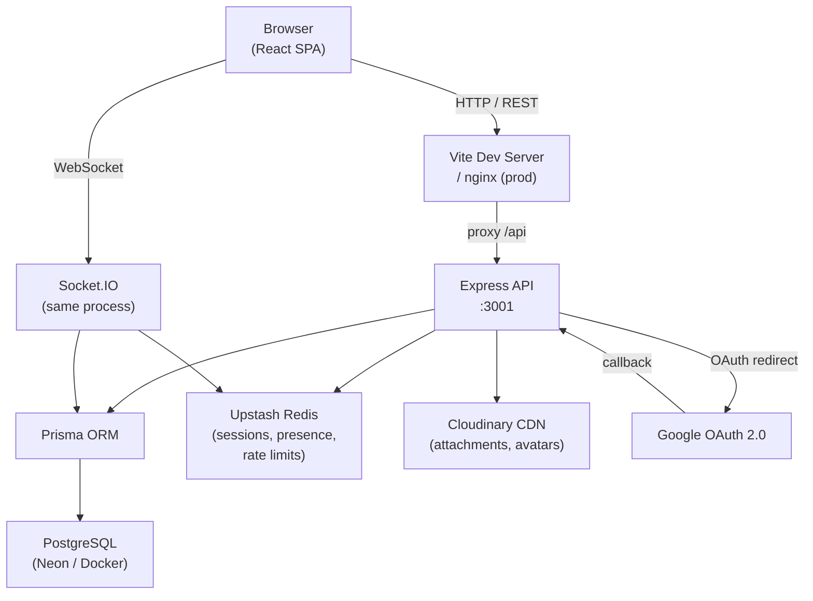
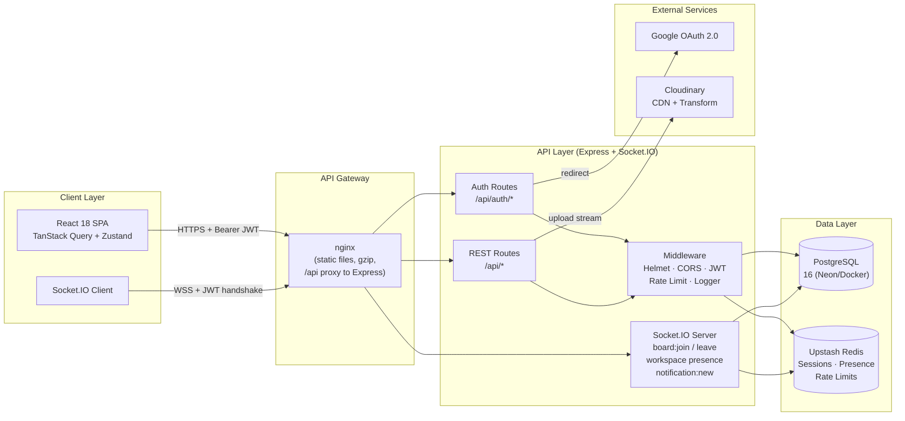
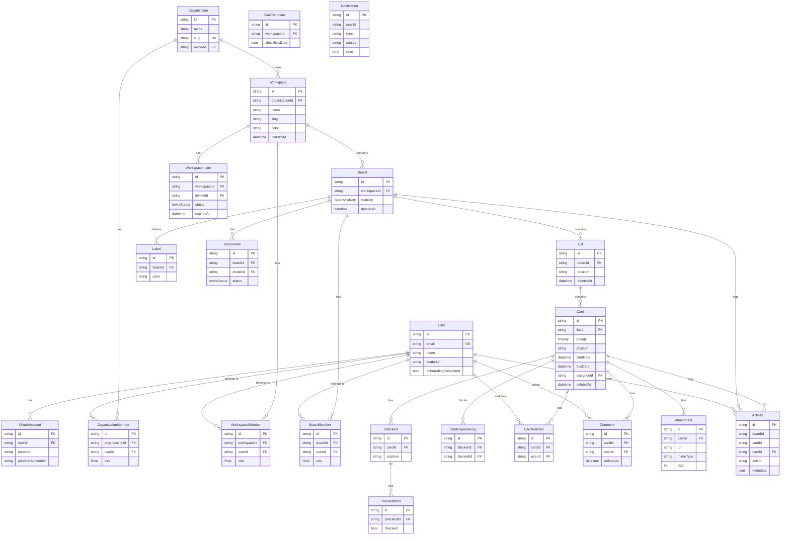
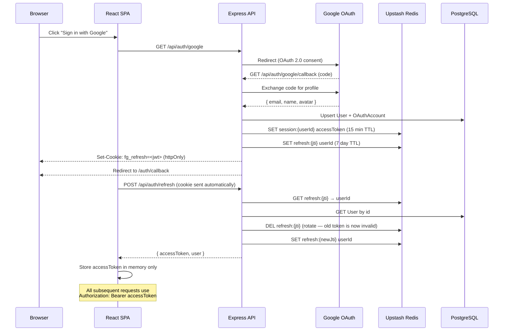
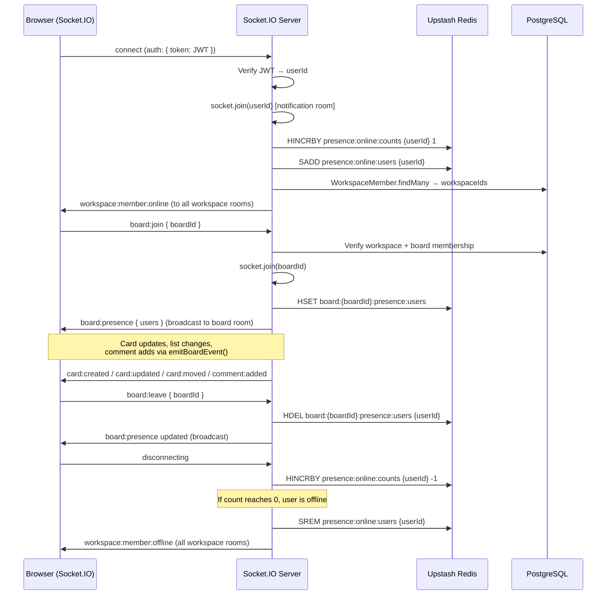
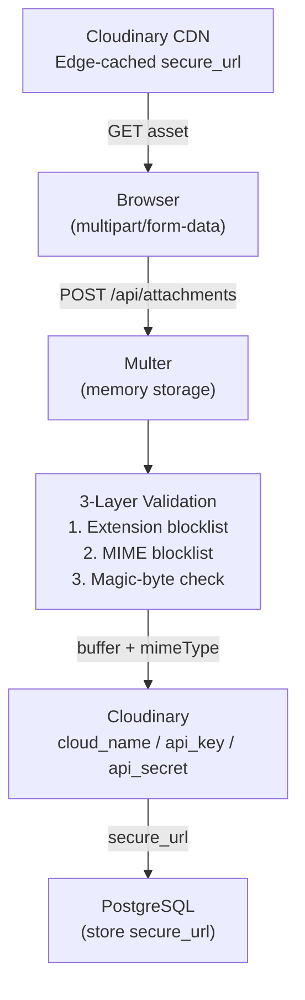

<div align="center">

# FlowGrid

**A production-grade Kanban project management platform with real-time collaboration, analytics, and a full notification system — built for teams that ship.**

<br/>

[](https://www.typescriptlang.org/)
[](https://react.dev/)
[](https://nodejs.org/)
[](https://www.postgresql.org/)
[](https://www.prisma.io/)
[](https://socket.io/)
[](https://cloudinary.com/)
[](https://www.docker.com/)
[](https://pnpm.io/)
[](https://turbo.build/)
[](https://github.com/yuvrajsatyapal/FlowGrid/actions)
[](./LICENSE)

</div>

---

## Table of Contents

- [Screenshots](#screenshots)
- [Project Overview](#project-overview)
- [Key Features](#key-features)
- [Tech Stack](#tech-stack)
- [System Architecture](#system-architecture)
- [High-Level System Design](#high-level-system-design)
- [Folder Structure](#folder-structure)
- [Database Schema](#database-schema)
- [Authentication Flow](#authentication-flow)
- [Real-Time Architecture](#real-time-architecture)
- [Storage Architecture](#storage-architecture)
- [API Reference](#api-reference)
- [Environment Variables](#environment-variables)
- [Local Development](#local-development)
- [Production Deployment](#production-deployment)
- [Security](#security)
- [Performance](#performance)
- [Project Workflow](#project-workflow)
- [CI / CD](#ci--cd)
- [License](#license)

---

## Screenshots

### Landing Page


### Workspace Home — Board Grid


### Kanban Board


### Card Details Modal


### Analytics Dashboard


### Inbox — Notifications


### Deadlines Calendar


### Activity Feed


### Workspace Members


### Workspace Settings


### Profile Page


---

## Project Overview

Modern teams waste time juggling disconnected tools. FlowGrid solves this by giving every team a single Kanban workspace where cards, deadlines, comments, files, and real-time collaboration live in one place.

**Who it is for:**
- Engineering teams tracking sprints
- Product teams managing roadmaps
- Small businesses coordinating projects
- Anyone who wants Trello-level simplicity with Jira-level depth

**Key problems it solves:**

| Problem | FlowGrid Solution |
|---|---|
| Scattered task management | Kanban boards with lists, cards, priorities, and deadlines |
| No visibility into team activity | Append-only activity audit log + real-time updates |
| File and attachment chaos | Cloudinary-backed attachments with 3-layer security validation |
| Missing your own due dates | Dedicated deadlines view with date-aware color coding |
| Not knowing what your teammates are doing | Live board presence indicators backed by Redis |
| Delayed notification delivery | Socket.IO push notifications delivered in-app instantly |
| No insight into workspace health | Analytics dashboard with trend metrics and Excel export |

---

## Key Features

### Workspace & Organization Management
- **3-tier hierarchy**: Organization → Workspace → Board
- Create and manage multiple workspaces per organization
- Workspace colors, logos (Cloudinary upload), and descriptions
- Soft-deleted workspaces (data preserved, never hard-deleted)
- Role-based access: `OWNER`, `ADMIN`, `MEMBER`, `VIEWER`
- Workspace invite system with in-app notifications

### Board Management
- Create unlimited Kanban boards per workspace
- Board visibility: `WORKSPACE` (all members) or `PRIVATE` (explicit invite only)
- Cover color theming per board
- Private board invites for workspace members
- Board-level membership and role overrides
- Board-scoped label system (color-coded)

### Card Management (Full-Featured)
- Rich-text description editor powered by **Tiptap**
- Priority levels: `NONE`, `LOW`, `MEDIUM`, `HIGH`, `URGENT`
- Start date and due date with date-aware color indicators
- Single assignee per card
- Cover color per card
- **Labels**: color-coded, board-scoped, multiple per card
- **Checklists**: multiple per card, ordered items, completion tracking
- **Attachments**: Cloudinary-backed, up to 25 MB, with extension blocklist + MIME blocklist + magic-byte validation
- **Comments**: with soft delete
- **Card dependencies**: link cards as blocker/blocked
- **Card watchers**: subscribe to a card to receive notifications
- **Card templates**: save card structure (with checklists) as reusable workspace templates
- Hard cap of 5 active cards per list (enforced at API + UI)
- Soft delete with `deletedAt`

### Drag & Drop
- Reorder cards within a list
- Move cards between lists on the same board
- Powered by `@dnd-kit` with optimistic UI updates

### Real-Time Collaboration
- **Board presence**: see who is currently viewing a board (avatars in header)
- **Workspace presence**: online/offline indicators per member
- Live card create / update / delete / reorder broadcast to all board members
- Live comment additions
- Real-time notification delivery to inbox
- Redis-backed presence counters (multi-tab aware — user stays online until last tab closes)
- Presence resets automatically on server restart (no stale "online" states)

### Full-Text Search
- PostgreSQL `tsvector` full-text search with `websearch_to_tsquery`
- Relevance-ranked results
- ILIKE fallback for stop-word-only queries
- Searches cards across all accessible boards in a workspace
- Private board access control enforced in search results

### Analytics Dashboard
- Configurable periods: 7, 30, or 90 days
- **Total metrics with trend %**: cards, boards, members, activities
- **Cards by priority**: bar chart
- **Cards by board**: top 8 boards by card count
- **Activity over time**: daily activity line chart
- **Top members**: ranked by activity count with role badges
- Export data to **Excel (XLSX)**
- Charts powered by Recharts

### Notifications & Inbox
- **Notification types**: `CARD_ASSIGNED`, `COMMENT_ADDED`, `WORKSPACE_INVITE`, `BOARD_INVITE`, `CARD_DUE_SOON`, `INVITE_ACCEPTED`, `CARD_UPDATED`
- **Notification sources**: `ASSIGNMENT`, `WATCHER`, `SYSTEM`
- Delivered instantly over Socket.IO
- Persistent inbox with read/unread state
- Accept or decline workspace/board invites directly from inbox

### Activity Feed
- Append-only audit log (`Activity` table) recording all board-level actions
- Workspace-wide activity page with pagination
- Card-level activity timeline inside the card modal
- Board-scoped activity feed

### Deadlines View
- All upcoming card due dates across the workspace
- Paginated by week (forward/back navigation)
- Color-coded by urgency: overdue (red), due today (amber), due tomorrow, later
- Priority badges inline

### Team Member Management
- List all workspace members with roles and online status
- Invite users to workspaces and private boards
- Remove members from workspace
- Transfer workspace ownership

### Keyboard Shortcuts
- Global shortcut handler (`useKeyboardShortcuts`) — fires only outside input contexts
- Shortcut reference modal accessible via keyboard

### Theming
- Dark / Light mode toggle (persisted via `ThemeContext`)
- Design tokens based on OKLCH color space

### User Profile
- Update display name and avatar (Cloudinary upload)
- View account details

---

## Tech Stack

| Layer | Technology | Purpose |
|---|---|---|
| **Frontend** | React 18 + Vite | SPA with fast HMR |
| **Language** | TypeScript 5.4 | End-to-end type safety |
| **Styling** | Tailwind CSS 3 | Utility-first styling |
| **State (server)** | TanStack Query v5 | Server-state caching, invalidation |
| **State (client)** | Zustand | Lightweight client-side store |
| **Routing** | React Router v6 | SPA client-side routing |
| **Animations** | Framer Motion | Page transitions, micro-animations |
| **Drag & Drop** | @dnd-kit | Accessible card reordering |
| **Rich Text** | Tiptap | Card description editor |
| **Charts** | Recharts | Analytics visualizations |
| **Calendar** | react-big-calendar | Deadlines calendar view |
| **HTTP Client** | Axios | API communication + interceptors |
| **Realtime (client)** | Socket.IO client | Live updates |
| **Export** | XLSX (SheetJS) | Excel export |
| **Testing** | Vitest + Testing Library | Unit + integration tests |
| **Backend** | Node.js 20 + Express 4 | REST API server |
| **ORM** | Prisma 5 | Type-safe database access |
| **Database** | PostgreSQL 16 | Primary data store |
| **Session/Cache** | Upstash Redis | JWT sessions, rate limiting, presence |
| **Authentication** | Passport.js + Google OAuth 2.0 | OAuth-only auth |
| **Tokens** | JWT (access + refresh) | Stateless auth with rotation |
| **File Storage** | Cloudinary | Attachments, avatars, logos |
| **File Upload** | Multer | Multipart form handling |
| **Realtime (server)** | Socket.IO 4 | WebSocket server |
| **Logging** | Winston | Structured HTTP + error logging |
| **Validation** | Zod | Environment variable validation |
| **Security** | Helmet + sanitize-html | HTTP headers + XSS prevention |
| **Rate Limiting** | @upstash/ratelimit | Sliding-window per-IP rate limits |
| **Monorepo** | pnpm workspaces + Turborepo | Multi-package build pipeline |
| **Containers** | Docker (multi-stage) | Reproducible production builds |
| **CI** | GitHub Actions | Typecheck, build, lint |

---

## System Architecture



---

## High-Level System Design



---

## Folder Structure

```
flowgrid/                       ← pnpm monorepo root
├── apps/
│   ├── api/                    ← Express + Prisma backend
│   │   ├── prisma/
│   │   │   ├── schema.prisma   ← Full database schema
│   │   │   ├── seed.ts         ← Dev seed data
│   │   │   └── migrations/     ← SQL migration history
│   │   ├── src/
│   │   │   ├── config/
│   │   │   │   └── env.ts      ← Zod-validated env schema
│   │   │   ├── lib/
│   │   │   │   ├── socket.ts   ← Socket.IO server + Redis presence
│   │   │   │   ├── redis.ts    ← Upstash Redis client + key schema
│   │   │   │   ├── prisma.ts   ← Prisma client singleton
│   │   │   │   ├── jwt.ts      ← Token signing + verification
│   │   │   │   ├── passport.ts ← Google OAuth strategy
│   │   │   │   ├── storage.ts  ← Cloudinary StorageProvider
│   │   │   │   ├── notifications.ts ← createNotification helper
│   │   │   │   ├── activity.ts ← logActivity helper
│   │   │   │   ├── roles.ts    ← RBAC helpers (canWrite, etc.)
│   │   │   │   └── logger.ts   ← Winston logger
│   │   │   ├── middleware/
│   │   │   │   ├── auth.ts     ← validateJWT middleware
│   │   │   │   ├── rateLimit.ts ← Upstash sliding-window rate limit
│   │   │   │   ├── errorHandler.ts
│   │   │   │   └── requestLogger.ts
│   │   │   ├── routes/         ← One file per API module
│   │   │   │   ├── auth.ts
│   │   │   │   ├── users.ts
│   │   │   │   ├── workspaces.ts
│   │   │   │   ├── boards.ts
│   │   │   │   ├── lists.ts
│   │   │   │   ├── cards.ts
│   │   │   │   ├── labels.ts
│   │   │   │   ├── checklists.ts
│   │   │   │   ├── comments.ts
│   │   │   │   ├── attachments.ts
│   │   │   │   ├── card-dependencies.ts
│   │   │   │   ├── card-watchers.ts
│   │   │   │   ├── card-templates.ts
│   │   │   │   ├── invites.ts
│   │   │   │   ├── notifications.ts
│   │   │   │   ├── activities.ts
│   │   │   │   ├── search.ts
│   │   │   │   ├── analytics.ts
│   │   │   │   └── health.ts
│   │   │   ├── types/
│   │   │   │   └── express.d.ts ← Express Request augmentation
│   │   │   └── index.ts         ← App bootstrap + route registration
│   │   ├── generated/prisma/    ← Auto-generated Prisma client
│   │   ├── Dockerfile
│   │   └── .env.example
│   │
│   └── web/                    ← React 18 + Vite frontend SPA
│       ├── src/
│       │   ├── api/            ← One file per API module (Axios)
│       │   │   ├── auth.ts
│       │   │   ├── workspaces.ts
│       │   │   ├── boards.ts
│       │   │   ├── cards.ts
│       │   │   └── ... (14 total API modules)
│       │   ├── components/
│       │   │   ├── auth/       ← ProtectedRoute, PublicRoute
│       │   │   ├── layout/     ← AppLayout, sidebar, nav
│       │   │   ├── boards/     ← BoardCard, CreateBoardModal, EditBoardModal
│       │   │   └── search/     ← Global search overlay
│       │   ├── contexts/
│       │   │   ├── AuthContext.tsx  ← JWT token management + auto-refresh
│       │   │   └── ThemeContext.tsx ← Dark/light mode
│       │   ├── hooks/
│       │   │   ├── useBoardSocket.ts
│       │   │   ├── useWorkspaceSocket.ts
│       │   │   ├── useNotifications.ts
│       │   │   ├── useSearch.ts
│       │   │   ├── useAnalytics.ts
│       │   │   ├── useKeyboardShortcuts.ts
│       │   │   └── useWindowWidth.ts
│       │   ├── pages/          ← One file per route
│       │   │   ├── LandingPage.tsx
│       │   │   ├── LoginPage.tsx
│       │   │   ├── OnboardingPage.tsx
│       │   │   ├── DashboardPage.tsx
│       │   │   ├── WorkspacePage.tsx
│       │   │   ├── BoardPage.tsx
│       │   │   ├── AnalyticsPage.tsx
│       │   │   ├── InboxPage.tsx
│       │   │   ├── AllActivityPage.tsx
│       │   │   ├── AllDeadlinesPage.tsx
│       │   │   ├── WorkspaceMembersPage.tsx
│       │   │   ├── WorkspaceSettingsPage.tsx
│       │   │   ├── ProfilePage.tsx
│       │   │   └── InviteAcceptPage.tsx
│       │   ├── stores/
│       │   │   └── workspaceStore.ts ← Zustand active workspace
│       │   ├── lib/
│       │   │   ├── axiosInstance.ts  ← Axios + auth interceptor
│       │   │   ├── queryClient.ts    ← TanStack Query config
│       │   │   └── socket.ts         ← Socket.IO client singleton
│       │   └── App.tsx              ← Router + auth guards
│       ├── Dockerfile
│       ├── nginx.conf               ← SPA routing + /api proxy
│       └── .env.example
│
├── packages/
│   ├── types/                  ← Shared TypeScript interfaces
│   │   └── src/index.ts        ← All domain types (mirrors schema.prisma)
│   └── eslint-config/          ← Shared ESLint configuration
│
├── docker-compose.yml          ← Local dev stack (postgres + api + web)
├── turbo.json                  ← Turborepo task pipeline
├── pnpm-workspace.yaml
└── package.json                ← Root scripts + engine constraints
```

---

## Database Schema

FlowGrid uses a 4-tier hierarchy: **Organization → Workspace → Board → Card**, with soft deletes at every business tier.



### Key Design Decisions

| Decision | Rationale |
|---|---|
| Soft deletes (`deletedAt`) on Workspace, Board, List, Card, Comment | Preserve data for audit; hard delete only available to admins |
| FK constraints with CASCADE | Safe because CASCADEs only fire on hard deletes; soft deletes are handled in application code |
| `Activity.boardId` / `cardId` use `SET NULL` (not CASCADE) | Audit records survive even if a board or card is hard-purged |
| `position` stored as 8-digit zero-padded string | Race-free positional ordering using `SERIALIZABLE` transactions |
| Partial unique index on `WorkspaceInvite(workspaceId, inviteeId)` WHERE `PENDING` | One pending invite per pair; historical rows preserved |
| `Card.searchVector` tsvector column | Full-text search without a separate search service |

---

## Authentication Flow

FlowGrid uses **Google OAuth 2.0 only** — no passwords. Access tokens are short-lived JWTs; refresh tokens are stored in HTTP-only cookies and rotated on every use.



**Token lifecycle:**
- Access token: **15 minutes**, stored in memory (never in `localStorage`)
- Refresh token: **7 days**, HTTP-only `SameSite=Lax` cookie — inaccessible to JavaScript
- Rotation: every `/refresh` call invalidates the old refresh JTI and issues a new pair
- Logout: both Redis keys are deleted; cookie is cleared immediately

---

## Real-Time Architecture

FlowGrid uses Socket.IO 4 running in the same process as Express. Presence state is stored in Upstash Redis so it survives server restarts cleanly.



**Socket event catalogue:**

| Event | Direction | Description |
|---|---|---|
| `board:join` | Client → Server | Join a board room (access-checked) |
| `board:leave` | Client → Server | Leave a board room |
| `board:presence` | Server → Board Room | Current viewers list |
| `board:error` | Server → Client | Access denied or board not found |
| `workspace:join` | Client → Server | Subscribe to workspace presence |
| `workspace:leave` | Client → Server | Unsubscribe |
| `workspace:member:online` | Server → Workspace Room | User came online |
| `workspace:member:offline` | Server → Workspace Room | User went offline |
| `card:created` | Server → Board Room | New card added |
| `card:updated` | Server → Board Room | Card field changed |
| `card:deleted` | Server → Board Room | Card soft-deleted |
| `card:reordered` | Server → Board Room | Card position changed |
| `card:moved` | Server → Board Room | Card moved between lists |
| `comment:added` | Server → Board Room | New comment on a card |
| `notification:new` | Server → User Room | New notification delivered |

**Redis key schema:**

| Key | Type | Purpose |
|---|---|---|
| `session:{userId}` | String | Active access token (15 min TTL) |
| `refresh:{jti}` | String | Refresh JTI → userId (7 day TTL) |
| `board:{boardId}:presence:users` | Hash | userId → PresenceUser JSON |
| `board:{boardId}:presence:counts` | Hash | userId → socket connection count |
| `presence:online:users` | Set | All currently online userIds |
| `presence:online:counts` | Hash | userId → total socket connection count |
| `rl:auth:{ip}` | Upstash-managed | Auth rate limit sliding window |

---

## Storage Architecture

All file uploads — card attachments, user avatars, workspace logos — go through Cloudinary. There is no local disk storage.



**Upload rules:**

| Check | Blocks |
|---|---|
| Extension blocklist | `.exe`, `.sh`, `.bat`, `.cmd`, `.ps1`, `.app`, `.dmg`, `.pkg`, `.deb`, `.rpm`, `.jar` and more |
| MIME type blocklist | `application/x-msdownload`, `application/x-sh`, `application/java-archive` and more |
| Magic-byte check | Windows PE (`MZ`), ELF (`\x7fELF`), Java class (`CAFEBABE`) — catches renamed executables |
| Max file size | Files larger than 25 MB |

**Asset lifecycle:**

1. **Upload** → Multer buffers in memory → validation → streamed to Cloudinary via `upload_stream` → `secure_url` stored in DB
2. **Download** → client fetches directly from Cloudinary CDN (no API proxy)
3. **Delete** → `keyFromUrl()` extracts the Cloudinary `public_id` from the URL → `cloudinary.uploader.destroy()` with `invalidate: true` (purges CDN edge cache)
4. **Card delete** → compensating deletes fire for all attachments on cascade

---

## API Reference

All endpoints are prefixed with `/api`. JWT required on all routes except `/api/auth/*` and `/api/health`.

### Authentication — `/api/auth`

| Method | Path | Description |
|---|---|---|
| `GET` | `/google` | Initiate Google OAuth flow |
| `GET` | `/google/callback` | OAuth callback — issue tokens, set cookie |
| `POST` | `/refresh` | Exchange httpOnly cookie for new access token |
| `POST` | `/logout` | Revoke session + clear cookie |

### Users — `/api/users`

| Method | Path | Description |
|---|---|---|
| `GET` | `/me` | Get authenticated user profile |
| `PATCH` | `/me` | Update display name or avatar |
| `GET` | `/` | Search users by email (invite lookup) |

### Workspaces — `/api/workspaces`

| Method | Path | Description |
|---|---|---|
| `GET` | `/` | List workspaces for authenticated user |
| `POST` | `/` | Create workspace |
| `GET` | `/:id` | Get workspace detail |
| `PATCH` | `/:id` | Update name, description, logo, color |
| `DELETE` | `/:id` | Soft-delete workspace |
| `GET` | `/:id/members` | List members with online status |
| `PATCH` | `/:id/members/:userId` | Change member role |
| `DELETE` | `/:id/members/:userId` | Remove member |

### Boards — `/api/boards`

| Method | Path | Description |
|---|---|---|
| `GET` | `/` | List boards for workspace |
| `POST` | `/` | Create board |
| `GET` | `/:id` | Get board with lists and cards |
| `PATCH` | `/:id` | Update board metadata |
| `DELETE` | `/:id` | Soft-delete board |

### Lists — `/api/lists`

| Method | Path | Description |
|---|---|---|
| `POST` | `/` | Create list |
| `PATCH` | `/:id` | Rename or recolor list |
| `DELETE` | `/:id` | Soft-delete list |
| `PATCH` | `/:id/position` | Reorder list |

### Cards — `/api/cards`

| Method | Path | Description |
|---|---|---|
| `POST` | `/` | Create card |
| `GET` | `/:id` | Get card detail |
| `PATCH` | `/:id` | Update any card field |
| `DELETE` | `/:id` | Soft-delete card |
| `PATCH` | `/:id/position` | Move or reorder card |
| `GET` | `/upcoming` | Cards with upcoming due dates (deadlines view) |

### Labels — `/api/labels`

| Method | Path | Description |
|---|---|---|
| `GET` | `/` | List board labels |
| `POST` | `/` | Create label |
| `PATCH` | `/:id` | Update label name or color |
| `DELETE` | `/:id` | Delete label |
| `POST` | `/card` | Attach label to card |
| `DELETE` | `/card` | Detach label from card |

### Checklists — `/api/checklists`

| Method | Path | Description |
|---|---|---|
| `POST` | `/` | Create checklist on card |
| `PATCH` | `/:id` | Rename checklist |
| `DELETE` | `/:id` | Delete checklist |
| `POST` | `/:id/items` | Add checklist item |
| `PATCH` | `/:id/items/:itemId` | Toggle or rename item |
| `DELETE` | `/:id/items/:itemId` | Delete item |

### Comments — `/api/comments`

| Method | Path | Description |
|---|---|---|
| `GET` | `/` | List comments for card |
| `POST` | `/` | Add comment |
| `PATCH` | `/:id` | Edit comment |
| `DELETE` | `/:id` | Soft-delete comment |

### Attachments — `/api/attachments`

| Method | Path | Description |
|---|---|---|
| `GET` | `/` | List attachments for card |
| `POST` | `/` | Upload attachment (multipart/form-data) |
| `DELETE` | `/:id` | Delete attachment + Cloudinary asset |

### Card Dependencies — `/api/card-dependencies`

| Method | Path | Description |
|---|---|---|
| `GET` | `/` | Get dependencies for card |
| `POST` | `/` | Create blocker/blocked link |
| `DELETE` | `/:id` | Remove dependency |

### Card Watchers — `/api/card-watchers`

| Method | Path | Description |
|---|---|---|
| `POST` | `/` | Watch a card |
| `DELETE` | `/` | Unwatch a card |

### Card Templates — `/api/card-templates`

| Method | Path | Description |
|---|---|---|
| `GET` | `/` | List templates for workspace |
| `POST` | `/` | Create template |
| `DELETE` | `/:id` | Delete template |
| `POST` | `/:id/apply` | Apply template to card |

### Invites — `/api/invites`

| Method | Path | Description |
|---|---|---|
| `POST` | `/workspace` | Send workspace invite |
| `POST` | `/board` | Send board invite |
| `POST` | `/accept` | Accept invite |
| `POST` | `/decline` | Decline invite |
| `DELETE` | `/:id/revoke` | Revoke pending invite |

### Notifications — `/api/notifications`

| Method | Path | Description |
|---|---|---|
| `GET` | `/` | List notifications (paginated) |
| `PATCH` | `/:id/read` | Mark notification as read |
| `PATCH` | `/read-all` | Mark all notifications as read |

### Activities — `/api/activities`

| Method | Path | Description |
|---|---|---|
| `GET` | `/` | List activities for board or card |

### Search — `/api/search`

| Method | Path | Description |
|---|---|---|
| `GET` | `/` | Full-text search cards in workspace |

### Analytics — `/api/analytics`

| Method | Path | Description |
|---|---|---|
| `GET` | `/` | Workspace analytics (configurable period: 7/30/90 days) |

### Health — `/api/health`

| Method | Path | Description |
|---|---|---|
| `GET` | `/health` | Liveness check |

---

## Environment Variables

### Backend (`apps/api/.env`)

| Variable | Required | Default | Description |
|---|---|---|---|
| `DATABASE_URL` | ✅ | — | PostgreSQL connection string (Neon or local Docker) |
| `UPSTASH_REDIS_REST_URL` | ✅ | — | Upstash Redis HTTP REST URL |
| `UPSTASH_REDIS_REST_TOKEN` | ✅ | — | Upstash Redis auth token |
| `GOOGLE_CLIENT_ID` | ✅ | — | Google OAuth 2.0 client ID |
| `GOOGLE_CLIENT_SECRET` | ✅ | — | Google OAuth 2.0 client secret |
| `JWT_SECRET` | ✅ | — | Access token signing secret (min 32 chars) |
| `JWT_REFRESH_SECRET` | ✅ | — | Refresh token signing secret (min 32 chars, different from JWT_SECRET) |
| `CLOUDINARY_CLOUD_NAME` | ✅ | — | Cloudinary cloud name |
| `CLOUDINARY_API_KEY` | ✅ | — | Cloudinary API key |
| `CLOUDINARY_API_SECRET` | ✅ | — | Cloudinary API secret |
| `NODE_ENV` | — | `development` | `development` \| `production` \| `test` |
| `PORT` | — | `3001` | API server port |
| `CORS_ORIGIN` | — | `http://localhost:5173` | Allowed CORS origin |
| `API_BASE_URL` | — | — | Public API URL used in OAuth callback URL (required in production) |
| `APP_URL` | — | `http://localhost:5173` | Public app URL used in invite email links |
| `LOG_LEVEL` | — | `http` | Winston log level: `debug` \| `http` \| `warn` \| `error` |

### Frontend (`apps/web/.env`)

| Variable | Required | Default | Description |
|---|---|---|---|
| `VITE_API_BASE_URL` | — | `""` | API base URL. Empty string = relative `/api` path (proxied via nginx). Set to `https://api.yourdomain.com` for separate API domain in production. |

---

## Local Development

### Prerequisites

| Tool | Minimum Version | Notes |
|---|---|---|
| Node.js | 20 | Enforced in `package.json#engines` |
| pnpm | 9 | `npm install -g pnpm@9` |
| Docker + Docker Compose | Any recent version | For local PostgreSQL |
| Upstash account | — | Redis (required — uses HTTP REST, no local container) |
| Cloudinary account | — | File storage (required in all environments) |
| Google Cloud project | — | OAuth 2.0 credentials |

### Setup

```bash
# 1. Clone the repository
git clone https://github.com/yuvrajsatyapal/FlowGrid.git
cd FlowGrid

# 2. Install all workspace dependencies
pnpm install

# 3. Start local PostgreSQL
docker compose up -d postgres

# 4. Configure the API environment
cp apps/api/.env.example apps/api/.env
# Open apps/api/.env and fill in:
#   UPSTASH_REDIS_REST_URL + UPSTASH_REDIS_REST_TOKEN  (from console.upstash.com)
#   GOOGLE_CLIENT_ID + GOOGLE_CLIENT_SECRET            (from console.cloud.google.com)
#   JWT_SECRET + JWT_REFRESH_SECRET                    (generate with: node -e "console.log(require('crypto').randomBytes(64).toString('hex'))")
#   CLOUDINARY_CLOUD_NAME + CLOUDINARY_API_KEY + CLOUDINARY_API_SECRET  (from console.cloudinary.com)

# 5. Configure the frontend environment
cp apps/web/.env.example apps/web/.env
# Default value (VITE_API_BASE_URL=http://localhost:3001) works without changes

# 6. Generate Prisma client
pnpm --filter @flowboard/api exec prisma generate

# 7. Run database migrations
pnpm --filter @flowboard/api exec prisma migrate dev

# 8. (Optional) Seed development data
pnpm --filter @flowboard/api exec prisma db seed

# 9. Start everything
pnpm dev
```

| Service | URL |
|---|---|
| Frontend | http://localhost:5173 |
| API | http://localhost:3001 |
| Prisma Studio | Run `pnpm --filter @flowboard/api exec prisma studio` |

### Development Commands

```bash
pnpm dev          # Start frontend + backend in parallel (Turborepo)
pnpm build        # Production build all packages
pnpm typecheck    # TypeScript check across all workspaces
pnpm lint         # ESLint across all workspaces
pnpm format       # Prettier (all .ts, .tsx, .json, .md)
pnpm test         # Vitest (frontend unit tests)
```

---

## Production Deployment

### Option A — Docker Compose (self-hosting)

```bash
# 1. Clone and configure
git clone https://github.com/yuvrajsatyapal/FlowGrid.git
cd FlowGrid
cp apps/api/.env.example apps/api/.env
# Fill in all required secrets

# 2. Start the full stack (builds on first run)
docker compose up -d --build

# 3. Apply migrations (first deploy only)
docker compose exec api npx prisma migrate deploy
```

Services exposed:
| Service | Port |
|---|---|
| Web (nginx) | 8080 |
| API (Node.js) | 3001 |
| PostgreSQL | 5432 |

### Option B — Separate Deployments

**API:**
```bash
# Build
pnpm install --frozen-lockfile
pnpm --filter @flowboard/api exec prisma generate
pnpm --filter @flowboard/api exec prisma migrate deploy
pnpm --filter @flowboard/api build

# Run
NODE_ENV=production node apps/api/dist/index.js
```

**Web (static):**
```bash
VITE_API_BASE_URL=https://api.yourdomain.com \
  pnpm --filter @flowboard/web build
# Deploy apps/web/dist/ to Vercel, Netlify, S3+CloudFront, or nginx
```

### Production Environment Requirements

```bash
# Required additions for production
NODE_ENV=production
API_BASE_URL=https://api.yourdomain.com       # OAuth callback URL
APP_URL=https://yourdomain.com                # Invite email link base
CORS_ORIGIN=https://yourdomain.com            # Allowed origin
LOG_LEVEL=warn                                # Reduce log volume
```

**Recommended providers:**
- **Database**: [Neon](https://neon.tech) — serverless PostgreSQL, same connection string format
- **Redis**: [Upstash](https://upstash.com) — HTTP REST, works in any runtime
- **Storage**: Cloudinary — enable "Auto Quality" + "Auto Format" in dashboard for zero-config image optimization

---

## Security

### Authentication & Sessions
- **Google OAuth 2.0 only** — no passwords stored, no credential database
- Access tokens stored in memory only (never `localStorage` or `sessionStorage`)
- Refresh tokens in `httpOnly; SameSite=Lax` cookies — inaccessible to JavaScript
- Refresh token rotation on every use — a stolen token becomes instantly invalid
- Both tokens deleted from Redis on logout — true server-side session termination

### API Security
- **Helmet.js** — sets `X-Frame-Options`, `X-Content-Type-Options`, `Strict-Transport-Security`, `X-XSS-Protection`, `Referrer-Policy`, and more
- **Per-IP rate limiting** on all auth endpoints — 30 req/min (production), 300 req/min (development) via Upstash sliding window
- **JWT validation** middleware on every protected route
- **RBAC** — `canWrite()` role check enforced at the handler level for all mutations
- **Private board access** — two-layer check: workspace membership first, board membership second

### Input Validation
- Zod validates all environment variables at startup — process exits immediately on misconfiguration
- `sanitize-html` strips XSS payloads from comment HTML before storage
- Request body limited to 10 MB (JSON) and 25 MB (multipart)

### File Upload Security (3 independent layers)
1. **Extension blocklist** — `.exe`, `.sh`, `.bat`, `.cmd`, `.ps1`, `.app`, `.dmg`, `.pkg`, `.deb`, `.rpm`, `.msi`, `.jar` and more
2. **MIME type blocklist** — `application/x-msdownload`, `application/x-sh`, `application/java-archive`, `application/x-apple-diskimage` and more
3. **Magic-byte check** — reads first 4 bytes of every file regardless of reported extension or MIME type; blocks Windows PE (`MZ`), Linux ELF (`\x7fELF`), Java class (`CAFEBABE`)

### Infrastructure
- Docker containers run as non-root users (`apiuser` UID 1001, `nginx` user)
- Cloudinary CDN delivers assets; `invalidate: true` on delete purges the CDN edge cache
- Database credentials injected at runtime via `env_file` — never baked into images

---

## Performance

### Server-State Caching (TanStack Query)
- Board data, workspace lists, and card details cached client-side with configurable `staleTime`
- Selective cache invalidation — only the affected query key is refreshed, not the whole page
- `Promise.all` on the server for parallel queries (analytics endpoint runs 8 aggregations concurrently)

### Optimistic Updates
- Card reordering and list moves apply immediately in the UI; automatically rolled back on error
- Comment additions appear instantly before server confirmation
- TanStack Query `setQueryData` for direct cache writes — no refetch flicker

### Real-Time Deduplication
- Sender receives their own real-time events but uses dedup guards to avoid double-applying
- Presence uses reference counting in Redis — navigating between pages in the same session never flickers the user offline

### Database
- Dedicated indexes on all FK columns and frequently filtered fields
- Partial indexes for soft-delete queries (`WHERE deleted_at IS NULL`)
- PostgreSQL `tsvector` column for full-text search — no `LIKE '%q%'` table scans
- Analytics endpoint uses `$queryRaw` with `::text[]` for proper PostgreSQL index usage

### Pagination
- All list endpoints support `limit` + `offset`
- Deadlines, activity feed, search, and notifications are all paginated
- Analytics caps board data at 8 boards using `.slice(0, 8)` before sending to charts

---

## Project Workflow

```mermaid
flowchart LR
    subgraph Onboarding
        A["Sign in\nwith Google"] --> B["Create\nOrganization"]
        B --> C["Create\nWorkspace"]
    end

    subgraph Setup
        C --> D["Invite\nTeam Members"]
        D --> E["Create\nKanban Board"]
        E --> F["Add Lists\n(e.g. To Do / In Progress / Done)"]
    end

    subgraph DailyWork
        F --> G["Create Cards\nwith Priority + Due Date"]
        G --> H["Assign Members\n+ Add Checklists"]
        H --> I["Attach Files\n+ Comment + Watch"]
        I --> J["Drag Card\nto Next List"]
    end

    subgraph Visibility
        J --> K["Team Notified\nin Real-Time"]
        K --> L["Review Analytics\n+ Activity Feed"]
        L --> M["Export\nto Excel"]
    end
```



---

## CI / CD

GitHub Actions runs automatically on every push and pull request targeting `main`.

```
typecheck-and-build
  ├── Checkout
  ├── Setup pnpm 9.4.0
  ├── Setup Node.js 20
  ├── pnpm install --frozen-lockfile
  ├── prisma generate
  ├── pnpm typecheck  (all workspaces — TypeScript errors fail the build)
  └── pnpm build      (all workspaces — catches missing imports, bundle errors)

lint (requires typecheck-and-build to pass)
  ├── pnpm install --frozen-lockfile
  ├── prisma generate
  └── pnpm lint       (ESLint across apps/api + apps/web)
```

---

## License

MIT License — see [LICENSE](./LICENSE) for details.

